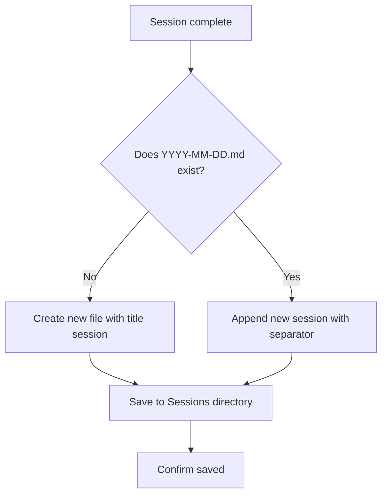

# Daily Record

## Overview

Generate structured work session logs using the US Army's After Action Review (AAR) framework combined with software engineering best practices. Creates actionable documentation for continuous learning and knowledge retention.

**Methodology Sources:**
- US Army After Action Review (AAR) 4-question framework
- [The Pragmatic Engineer work log template](https://blog.pragmaticengineer.com/work-log-template-for-software-engineers/)
- [Stack Overflow developer journal guide](https://stackoverflow.blog/2024/12/24/you-should-keep-a-developer-s-journal/)

## When to Use

Use this skill when:
- A task or project milestone is completed
- User explicitly requests to log/record the session
- A complex problem was solved and the solution should be documented
- Learning occurred that should be captured for future reference
- User asks "what did we do today?" or similar summary questions

## Log Template

### For New Daily File

If the daily file doesn't exist, create it with this structure:

```markdown
# YYYY-MM-DD - [Task/Project Title]

## Background (Optional)
Context about why this work was undertaken.

## AAR: Four Questions

### 1. What was supposed to happen?
State the intended objectives and expected results.

### 2. What actually happened?
Factual account of what occurred during the session.

### 3. Why did it happen?
Analyze causes of both successes and failures. Include:
- Decision points and reasoning
- Unexpected obstacles
- Root causes of deviations

### 4. What will we sustain or improve?
- **Sustain**: What went well and should be repeated
- **Improve**: What needs enhancement next time
- **Stop**: What should be avoided

## Technical Details
Record concrete information:
- Commands executed
- Code changes made
- Tools/technologies used
- Problems encountered and solutions

## Thinking Process
Document the reasoning behind key decisions:
- Alternative approaches considered
- Trade-offs evaluated
- Solution selection rationale

## Lessons Learned
Capture knowledge for future reference:
- Pitfalls encountered
- "Gotchas" discovered
- Insights that would help next time

## Follow-up Actions
- [ ] Specific TODOs
- [ ] Areas requiring further investigation
- [ ] Dependencies created

## Timeline
| Time | Activity |
|------|----------|
| HH:MM | Milestone 1 |
| HH:MM | Milestone 2 |
```

### For Appending to Existing Daily File

If `YYYY-MM-DD.md` already exists, append the new session:

```markdown

---

# Session N - [New Task/Project Title]
*(Time: HH:MM)*

[Same template structure as above]
```

**Rules for appending:**
- Add `---` separator between sessions
- Increment session number (Session 2, Session 3, etc.)
- Add timestamp for reference
- Maintain the same AAR structure

## Output Location

Save logs to: `/Users/bluesky/workspace/notes/homenotes/notes/Sessions/YYYY-MM-DD.md`

**File handling:**
1. Check if `YYYY-MM-DD.md` exists
2. If **new file**: Create with full template
3. If **exists**: Append new session with separator
4. Never create separate `-2.md`, `-3.md` files - always append to the daily file

## Workflow



**Step-by-step:**
1. Check for existing file at `/Users/bluesky/workspace/notes/homenotes/notes/Sessions/YYYY-MM-DD.md`
2. If missing: Create new file with session as main title
3. If exists: Append with `---` separator and "Session N" subtitle
4. Write content using the template structure
5. Verify file was saved successfully

## Writing Guidelines

### Be Specific
- ❌ "Fixed a bug"
- ✅ "Fixed image upload 403 error by adding --endpoint parameter to aliyun CLI command"

### Capture Context
Include enough detail that your future self can understand:
- What problem was being solved
- Why certain approaches were taken
- What constraints existed

### Record Failures
Document what didn't work alongside what did:
- Failed attempts and why they failed
- Dead ends and what they taught you
- Misconceptions that were corrected

### Make Actionable
Follow-up actions should be:
- Specific (not vague)
- Assignable (even if to yourself)
- Time-bound when possible

## Quick Reference

| Section | Purpose | When to Include |
|---------|---------|-----------------|
| Background | Provide context | Optional, for complex projects |
| AAR 4 Questions | Core reflection | Always required |
| Technical Details | Concrete info | When technical work was done |
| Thinking Process | Decision rationale | When meaningful choices were made |
| Lessons Learned | Knowledge capture | When something was learned |
| Follow-up Actions | Next steps | When there are clear TODOs |
| Timeline | Chronological record | Optional, for long sessions |

## Example Excerpt

```markdown
## AAR: Four Questions

### 1. What was supposed to happen?
Delete violating image from OSS bucket after receiving content moderation notice.

### 2. What actually happened?
First deletion attempt failed with 403 AccessDenied error. Investigation revealed the bucket was in Beijing region, not Hangzhou as configured. Used correct endpoint and deletion succeeded.

### 3. Why did it happen?
- Default aliyun CLI region (cn-hangzhou) didn't match bucket location (cn-beijing)
- Error message actually contained the correct endpoint in XML response
- Initially misinterpreted 403 as permission issue rather than region mismatch

### 4. What will we sustain or improve?
- **Sustain**: Parse error responses carefully for hidden solutions
- **Improve**: Create skill to automate endpoint detection
- **Stop**: Assuming 403 means permission issue in OSS context
```

### Example: Appending to Existing File

**Existing file** (`2026-01-21.md`):
```markdown
# 2026-01-21 - Aliyun OSS 违规文件删除 Skill 开发

[... existing content ...]
```

**Appending new session**:
```markdown

---

# Session 2 - Session Log Skill 创建
*(Time: 12:50)*

## AAR: Four Questions
[... new session content ...]
```
