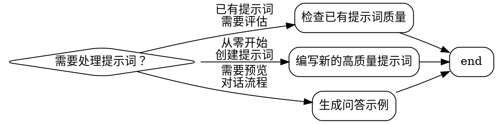
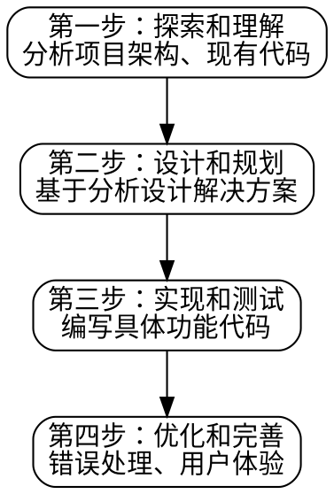

# Prompt Quality Checker

## Overview

**高质量的提示词是成功 AI 协作的基础。**

这个 skill 提供了检查、编写和优化 AI 提示词的系统化方法，基于 SMART 原则和渐进式对话模式。

**核心原则：** 从模糊到精确，建立完整上下文，遵循反馈循环。

## When to Use



**使用场景：**
- 用户提供的提示词过于简单或模糊（如"帮我写个函数"）
- 需要评估提示词的 SMART 原则符合度
- 需要引导用户编写高质量的提示词
- 需要生成预期的问答对话示例

**不适用场景：**
- 纯粹的技术 API 参考查询
- 已经非常详细和结构化的提示词

## Core Pattern

### 检查模式：从模糊到精确

**❌ 模糊提示词：**
```
帮我写个登录功能
```

**✅ 优化后的提示词：**
```
我需要为一个 React 应用创建用户登录功能。

**背景信息：**
- 项目使用 TypeScript 和 Next.js
- 已有基础的认证中间件
- UI 组件基于 Tailwind CSS

**具体要求：**
- 包含邮箱和密码验证
- 支持记住登录状态（使用 localStorage）
- 错误处理要友好（显示具体错误信息）
- 遵循项目现有的组件结构

**期望输出：**
1. 先分析现有的认证相关代码
2. 提供完整的实现方案
3. 包含前端组件和 API 路由
```

### 编写模式：渐进式对话



## Quick Reference

### SMART 原则检查清单

| 维度 | 检查问题 | 示例 |
|------|----------|------|
| **Specific 具体** | 需求是否明确？ | ❌ "写个登录"<br>✅ "为 React 应用写 TypeScript 登录组件" |
| **Measurable 可衡量** | 如何验证完成？ | ❌ "要好用"<br>✅ "支持邮箱密码验证、记住状态、错误提示" |
| **Achievable 可达成** | 范围是否合理？ | ❌ "完整电商系统"<br>✅ "用户注册功能（含邮箱验证）" |
| **Relevant 相关** | 是否有上下文？ | ❌ 无背景信息<br>✅ "基于现有认证中间件，使用 Tailwind CSS" |
| **Time-bound 有时限** | 是否有阶段划分？ | ❌ 一次性完成<br>✅ "先实现基础 CRUD，再添加验证逻辑" |

### 上下文管理模板

```
**项目背景：**
- 项目类型：[Web应用/CLI工具/库等]
- 技术栈：[主要技术和框架]
- 主要功能：[核心功能简述]

**编码规范：**
- [规范1，如：使用函数式组件]
- [规范2，如：错误处理采用 try-catch]
- [规范3，如：注释使用 JSDoc 格式]

**当前需求：**
- [具体要实现的功能]
- [期望的输出格式]
- [任何特殊的约束或偏好]
```

## Implementation

### 检查提示词质量

当用户提供提示词时，按以下步骤检查：

1. **SMART 维度评估**：逐一检查 5 个维度
2. **上下文完整度**：确认是否有项目背景、技术栈、规范
3. **结构清晰度**：检查是否有明确的需求、步骤、期望
4. **范围合理性**：判断是否需要分解成多个子任务

**输出格式：**
```markdown
## 提示词质量评估

### 符合度评分
- Specific: ⭐⭐☆☆☆ (2/5) - 缺少技术栈信息
- Measurable: ⭐⭐⭐☆☆ (3/5) - 有基本要求，但缺少验证标准
- Achievable: ⭐☆☆☆☆ (1/5) - 范围过大，需要分解
- Relevant: ⭐☆☆☆☆ (1/5) - 缺少项目上下文
- Time-bound: ⭐☆☆☆☆ (1/5) - 无阶段划分

### 改进建议
[具体建议列表]

### 优化后的提示词
[提供优化版本]
```

### 辅助编写提示词

当用户需要从零编写提示词时：

1. **探索阶段**：询问项目背景、技术栈、现有代码
2. **规划阶段**：帮助用户明确具体需求和范围
3. **编写阶段**：按照模板构建结构化提示词
4. **验证阶段**：用 SMART 原则检查并优化

**引导问题模板：**
```
请提供以下信息，帮助我为你生成更准确的提示词：

1. **项目类型**：这是什么类型的项目？
2. **技术栈**：使用哪些主要技术和框架？
3. **现有代码**：有哪些可以参考的现有实现？
4. **具体需求**：你希望实现什么功能？有什么特殊要求？
5. **编码规范**：项目遵循哪些编码规范？
```

### 生成问答示例

基于给定的提示词，生成预期的对话流程：

**示例格式：**
```markdown
## 预期对话流程

### 第一轮：理解与澄清
**用户：** [原始提示词]

**AI 可能的提问：**
- 当前项目使用什么状态管理方案？
- 是否有现有的认证相关代码可以参考？
- 对用户界面的样式有具体要求吗？

### 第二轮：用户补充
**用户：** [基于 AI 提问的回答]

**AI 的响应：** [分析后的实现建议]

### 可能的后续追问方向
1. 性能优化相关（如：是否需要防抖、节流）
2. 测试覆盖相关（如：需要写单元测试吗）
3. 部署相关（如：环境变量如何配置）
```

## Common Mistakes

| 错误 | 问题 | 解决方案 |
|------|------|----------|
| **提示词过于简单** | "帮我写个函数" | 明确输入、输出、边界条件和使用场景 |
| **忽略项目上下文** | 直接要求生成代码，不考虑现有架构 | 总是先建立项目背景和技术栈信息 |
| **一次性要求太多** | 想要一个完整的系统 | 使用渐进式对话，分步骤逐个击破 |
| **缺乏反馈循环** | 代码不对就重新开始 | 描述当前行为 vs 期望行为，建立反馈循环 |

## Real-World Impact

**案例对比：**

❌ **模糊提示词的结果：**
```
用户: "帮我写个登录功能"
AI: 生成一个通用但不符合项目规范的登录代码
结果: 需要多次返工，浪费 2-3 小时
```

✅ **SMART 提示词的结果：**
```
用户: [遵循模板的详细提示词]
AI: 一次性生成符合项目规范的代码
结果: 直接可用，节省返工时间
```

**数据对比：**
- 模糊提示词平均需要 **3-5 轮对话** 才能明确需求
- SMART 提示词通常 **1-2 轮** 即可完成
- 质量差距可达 **50-70%** 的返工率

## 合理化借口 vs 现实

| 借口 | 现实 |
|------|------|
| "用户只是想要快速实现" | 快但不准确会导致更多返工，总时间更长 |
| "AI 很强大能处理复杂需求" | 复杂需求需要上下文，AI 不能凭空猜测 |
| "已经投入时间重做太浪费" | 错误方向继续投入是更大的浪费 |
| "通用的实现也够用" | 不符合项目规范意味着需要大量修改 |
