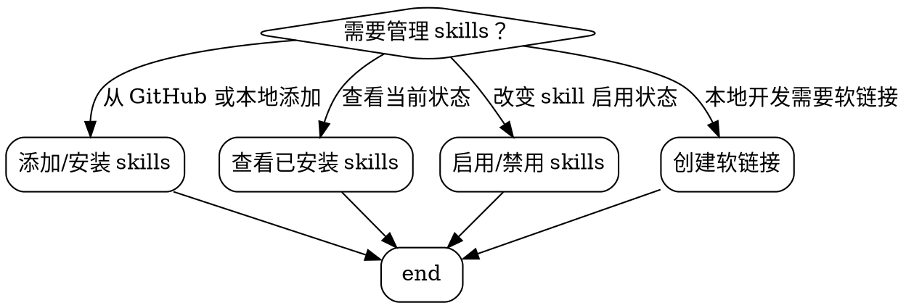

# Skill Manager

## Overview

**Grimoire 是统一的 AI agent skills 管理工具，支持 Claude Code、Codex、Cursor 等多个平台。**

这个 skill 封装了 Grimoire 的常用命令，让你能够快速管理 skills 而无需记忆所有命令语法。

**核心原则：** 共享 skills 目录（单一数据源）+ 软链接同步 + Grimoire 管理

## When to Use



**使用场景：**
- 需要从 GitHub 安装新 skill
- 需要启用/禁用已有 skill
- 需要查看当前项目已启用的 skills
- 需要为本地 skill 创建软链接（避免数据冗余）

## Quick Reference

| 操作 | 命令 | 说明 |
|------|------|------|
| **初始化** | `grimoire st skills init` | 首次使用时初始化 |
| **从 GitHub 安装** | `grimoire st skills install github:owner/repo` | 一键安装 |
| **添加到缓存** | `grimoire st skills add github:owner/repo` | 只添加不启用 |
| **启用 skill** | `grimoire st skills enable <name>` | 在当前项目启用 |
| **禁用 skill** | `grimoire st skills disable <name>` | 在当前项目禁用 |
| **列出所有** | `grimoire st skills list` | 查看可用和已启用 |
| **只看已启用** | `grimoire st skills list --enabled` | 只显示启用的 |
| **搜索 GitHub** | `grimoire st skills search <query>` | 搜索公开 skills |
| **同步更新** | `grimoire st skills sync` | 更新所有已启用 |

## Core Pattern

### Grimoire 工作流程


### 软链接方案（本地开发）

**为什么需要软链接：**
- Grimoire 默认复制文件到 `.claude/skills/`
- 本地开发时，修改原始文件不会同步到副本
- 软链接实现单一数据源，自动同步

**创建软链接：**
```bash
# 删除 Grimoire 创建的副本
rm -rf .claude/skills/skill-name

# 创建指向共享目录的软链接（使用绝对路径）
ln -s /Users/bluesky/workspace/skills/skill-name .claude/skills/skill-name
```

## Implementation

### 常用操作详解

#### 1. 初始化 Skills 系统

首次在项目中使用时：

```bash
# 自动检测 AI 类型
grimoire st skills init

# 或指定 AI 类型
grimoire st skills init --agent=claude_code
grimoire st skills init --agent=codex
grimoire st skills init --agent=cursor
```

**创建的文件：**
- `.grimoire/skills-state.json` - 状态跟踪
- `.claude/skills/` - skills 目录
- `CLAUDE.md` - Claude 配置文件

#### 2. 从 GitHub 安装 Skill

```bash
# 一键安装（add + enable）
grimoire st skills install github:owner/repo

# 指定版本
grimoire st skills install github:owner/repo@v1.0.0

# 安装并重命名
grimoire st skills install github:owner/repo --target my-skill
```

#### 3. 管理 Skills

```bash
# 查看所有 skills
grimoire st skills list

# 只看已启用的
grimoire st skills list --enabled

# 启用单个或多个
grimoire st skills enable skill-name
grimoire st skills enable skill1 skill2 skill3

# 禁用
grimoire st skills disable skill-name

# 自动确认（不提示）
grimoire st skills enable skill-name -y
```

#### 4. 搜索 Skills

```bash
# 搜索 GitHub
grimoire st skills search "testing"
grimoire st skills search "code review"
grimoire st skills search "prompt"
```

#### 5. 本地 Skills 的软链接管理

**场景：** 在共享目录 `/Users/bluesky/workspace/skills/` 开发 skills

```bash
# 1. 添加到 Grimoire 缓存
grimoire st skills add ./skill-name

# 2. 启用（这会复制文件）
grimoire st skills enable skill-name

# 3. 替换为软链接（实现单一数据源）
cd /path/to/project
rm -rf .claude/skills/skill-name
ln -s /Users/bluesky/workspace/skills/skill-name .claude/skills/skill-name
```

### 目录结构

```
# 共享 skills 目录（单一数据源）
/Users/bluesky/workspace/skills/
├── skill-1/                    # 实际文件
│   └── SKILL.md
├── skill-2/
│   └── SKILL.md
└── .git/

# Grimoire 缓存
~/.grimoire/
├── cache/
│   ├── skill-1/                # 缓存副本
│   └── skill-2/
└── skills-state.json           # 状态文件

# 项目中的引用
/path/to/project/
└── .claude/
    └── skills/
        ├── skill-1 -> ../../workspace/skills/skill-1  # 软链接
        └── skill-2 -> ../../workspace/skills/skill-2
```

## Common Mistakes

| 错误 | 问题 | 解决方案 |
|------|------|----------|
| **忘记初始化** | 直接运行 skills 命令报错 | 先运行 `grimoire st skills init` |
| **用错命令** | 使用 `grimoire` 而不是 `grimoire st` | skills 命令在 `st` 子命令下 |
| **相对路径软链接** | 软链接断开 | 使用绝对路径创建软链接 |
| **Grimoire 复制文件** | 修改原始文件不生效 | 用软链接替换副本 |

## Real-World Impact

**场景对比：**

❌ **没有 skill-manager：**
```
用户: "帮我添加个 skill"
AI: "让我查一下 Grimoire 的文档... 5分钟后... 好像是 grimoire st skills add"
结果: 浪费时间，用户体验差
```

✅ **有 skill-manager：**
```
用户: "帮我添加个 skill"
AI: "使用 grimoire st skills install github:owner/repo"
结果: 即时完成，用户满意
```

## 合理化借口 vs 现实

| 借口 | 现实 |
|------|------|
| "记不住所有命令很正常" | skill-manager 提供快速参考，1秒找到 |
| "Grimoire 就是这样设计的" | 可以手动创建软链接覆盖默认行为 |
| "重新配置太麻烦" | 一次性配置，长期受益 |
| "复制也够用了" | 修改原始文件不会同步，导致数据不一致 |

## 命令速查卡

```bash
# === 基础操作 ===
grimoire st skills init                    # 初始化
grimoire st skills list                    # 列出所有
grimoire st skills list --enabled          # 只看已启用

# === 安装与管理 ===
grimoire st skills install github:owner/repo    # 一键安装
grimoire st skills add github:owner/repo        # 添加到缓存
grimoire st skills enable <name>                # 启用
grimoire st skills disable <name>               # 禁用

# === 搜索与同步 ===
grimoire st skills search <query>           # 搜索 GitHub
grimoire st skills sync                     # 同步更新

# === 软链接管理 ===
rm -rf .claude/skills/skill-name            # 删除副本
ln -s /absolute/path .claude/skills/name    # 创建软链接
```

## 存储位置

| 路径 | 用途 |
|------|------|
| `~/.grimoire/` | Grimoire 全局配置和缓存 |
| `~/.grimoire/cache/` | Skills 缓存副本 |
| `~/.grimoire/skills-state.json` | 全局状态文件 |
| `.grimoire/skills-state.json` | 项目状态文件 |
| `.claude/skills/` | 当前项目的 skills 目录 |
| `/Users/bluesky/workspace/skills/` | 共享 skills 目录（主数据源） |
